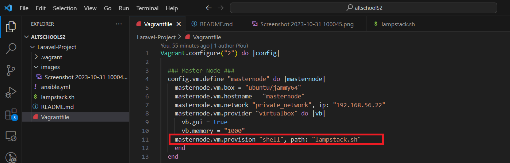
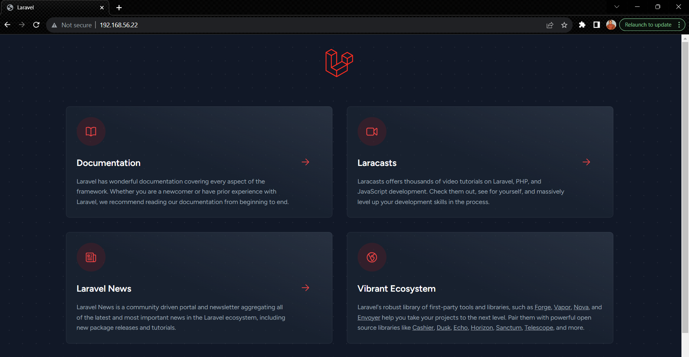
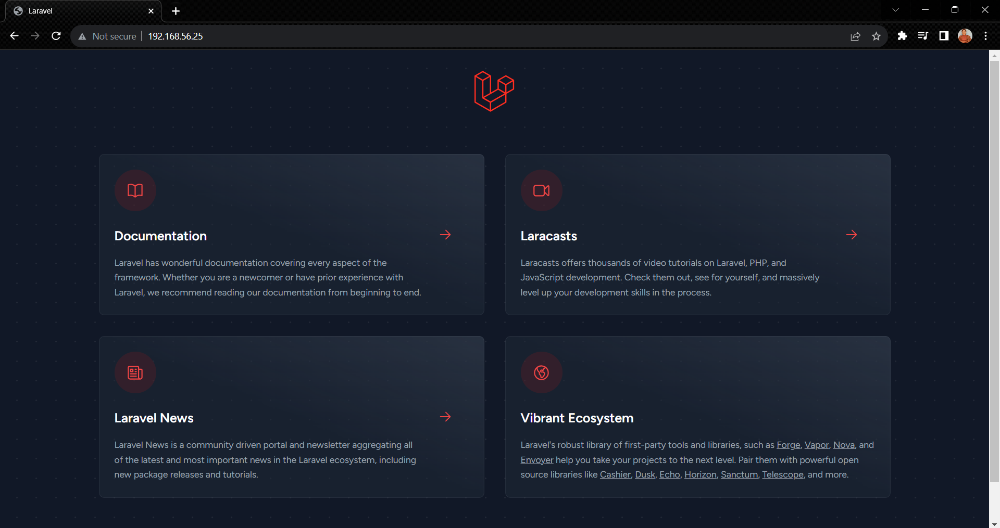

# Laravel-Project

## The objective of this project is to:
- Automate the provisioning of two Ubuntu-based servers, named "Master" and "Slave", using Vagrant.
- Create a bash script to automate the deployment of a LAMP (Linux, Apache, MySQL, PHP) stack on the Master node.
- Clone a PHP application from GitHub, install all necessary packages, and configure Apache web server and MySQL using the same bash script, i.e the `lampstack.sh`

## Prerequisite
- Vagrant
- Virtualbox
- Laravel app
- Ansible

## Setting up the two Ubuntu-based servers.
After installing both Vagrant and Virtualbox. Run the`vagrant init` command to initialize a new `Vagrantfile` in your project's root directory. Check `Vagrantfile` For a sample syntaxs for automating two servers. Next, run the `vagrant up` command to provision your servers. Once successful you'll have two servers in a `running` state on your Virtualbox.

## A. MasterNode

The masternode act as the controller while the slavenode is the target machine. On the `Vagrantfile` there's a `masternode` section, under which I have specified a path to a bashscript to automate the setup of LAMPSTACK and other configurations requried to serve the laravel application on the masternode server. 

Once done, visit http://192.168.56.22 to view the website on the browser

## B. Slavenode
- Execute the bash script on the Slave node and verify that the PHP application is accessible through the VM's IP address 
- Create a cron job to check the server's uptime every 12 am.

Firstly, you need to an ssh key pair on the host machine in this case, Windows using the WSL terminal. This will be used to authenticate into the target machine: slavenode. 

`ssh-keygen` to generate key pairs. Then, copy the public key: `id_rsa.pub` to the `authorized-keys` file in the slavenode. 

On WSL, run: `ssh vagrant@192.168.56.25` to validate that you can ssh into the target machine.

You can run the playbook by running: `ansible-playbook playbook.yml` and you should be able to view the laravel app on the browswer like below:

